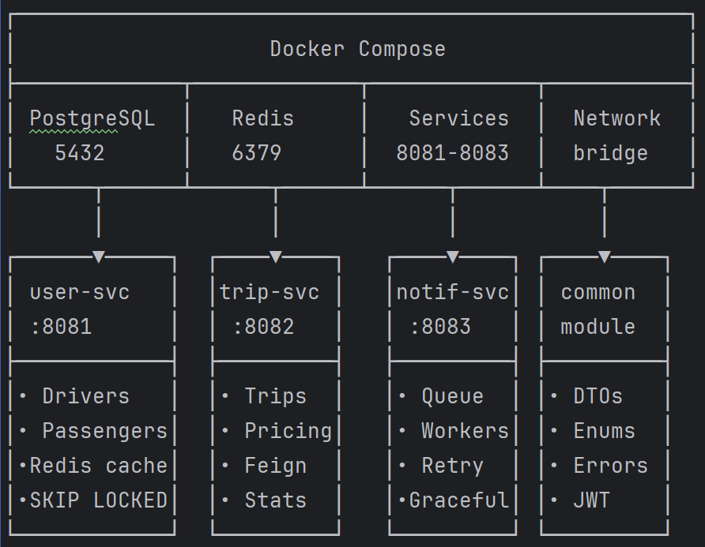

# Разработка микросервисного сервиса такси

## Архитектура

## Сборка проекта  
- mvn clean package -DskipTests

## Запуск через Docker Compose 
- Пересобрать проект 
mvn clean package -DskipTests 
######
- Остановить старые контейнеры или с остановть с очещением бд
docker compose down || docker compose down -v
######
- Пересобрать образы  
docker compose build --no-cache
######
- Запуск  
docker compose up -d
######
- Проверь статус  
docker compose ps
######
- Логи всех сервисов 
docker compose logs -f

## Тестовые данные

### 1. Регистрация пассажира
curl -v -w "\n>>> HTTP Status: %{http_code}\n" -X POST http://localhost:8081/passengers -H "Content-Type: application/json" -d '{"name":"Иван Петров","email":"ivan@taxi.test","phone":"+79991112233"}' | jq .

### 2. Регистрация двух водителей
curl -v -w "\n>>> HTTP Status: %{http_code}\n" -X POST http://localhost:8081/drivers -H "Content-Type: application/json" -d '{"name":"Алексей Смирнов","email":"alex@taxi.test","phone":"+79994445566","licenseNumber":"MSK001"}'

curl -v -w "\n>>> HTTP Status: %{http_code}\n" -X POST http://localhost:8081/drivers -H "Content-Type: application/json" -d '{"name":"Дмитрий Козлов","email":"dmitry@taxi.test","phone":"+79997778899","licenseNumber":"MSK002"}'

### 3. Установка статуса AVAILABLE для водителей
curl -v -w "\n>>> HTTP Status: %{http_code}\n" -X PATCH "http://localhost:8081/drivers/1/status?status=AVAILABLE"
curl -v -w "\n>>> HTTP Status: %{http_code}\n" -X PATCH "http://localhost:8081/drivers/2/status?status=AVAILABLE"

### 4. Создание поездки (система автоматически назначит водителя)
curl -v -w "\n>>> HTTP Status: %{http_code}\n" -X POST http://localhost:8082/trips -H "Content-Type: application/json" -d '{"passengerId":1,"origin":"Красная площадь","destination":"ВДНХ","distanceKm":12.5}'

### 5. Проверка поездки
curl http://localhost:8082/trips/1

### 6. Обновление статуса: водитель принял заказ
curl -X PATCH "http://localhost:8082/trips/1/status?status=IN_PROGRESS"

### 7. Обновление статуса: поездка завершена
curl -X PATCH "http://localhost:8082/trips/1/status?status=COMPLETED"

### 8. Оценка поездки
curl -X PATCH "http://localhost:8082/trips/1/rate?rating=5"

### 9. Проверка уведомлений
curl "http://localhost:8083/notifications?trip_id=1"

### 10. Статистика за день
curl http://localhost:8082/trips/stats/daily

### PostgreSQL: смотрим данные  
docker exec -it taxi-postgres psql -U taxi_user -d taxi_db -c "SELECT id,email,status FROM drivers; SELECT id,status,price FROM trips;"

### Redis: проверяем кэш  
docker exec -it taxi-redis redis-cli SMEMBERS drivers:available
- Должно быть пусто, если водитель занят